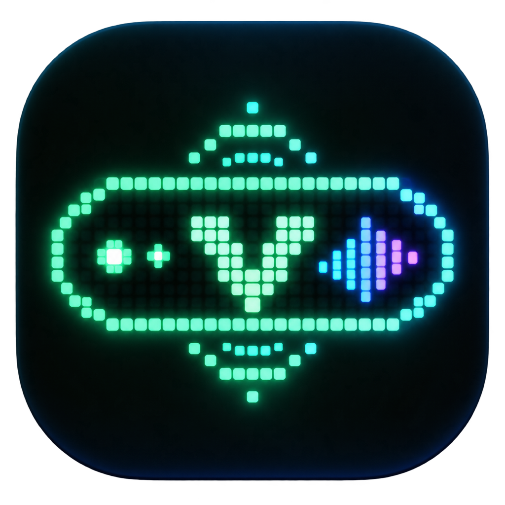
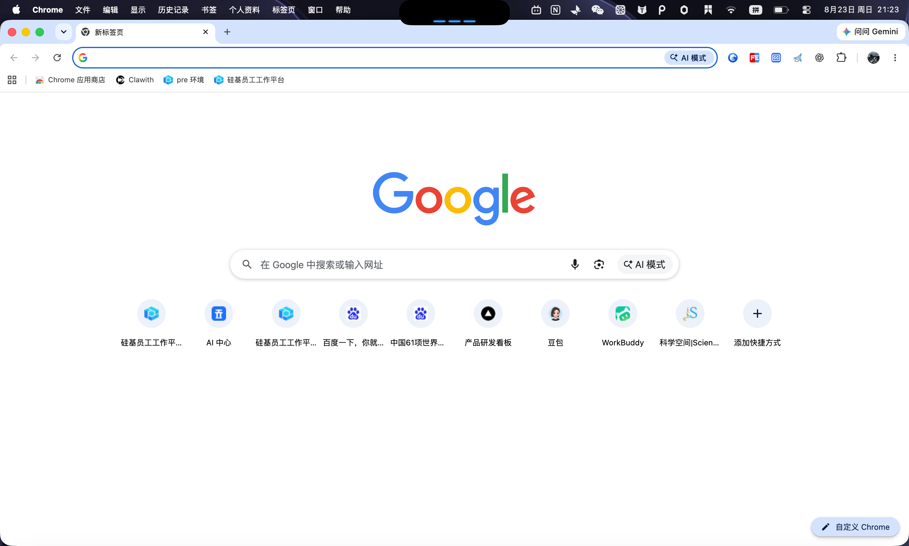
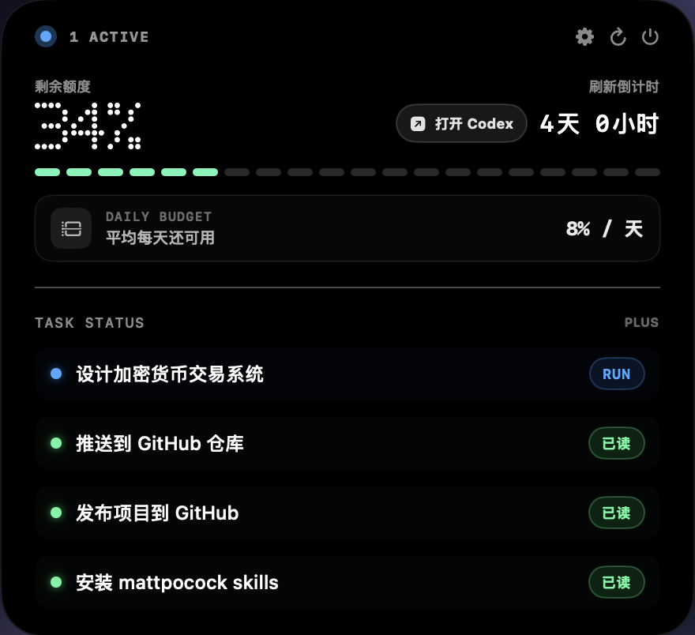
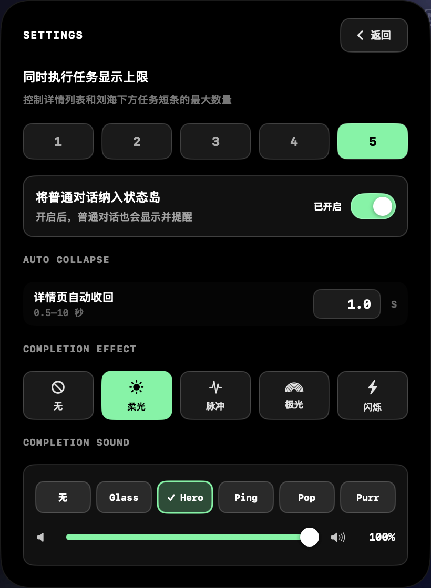
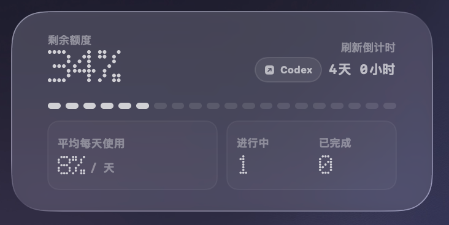

<div align="center">
  

# Vibe Island

**让 Codex 的额度与任务状态，始终停在 Mac 顶部。**

[](https://www.apple.com/macos/)
[](https://www.swift.org/)
[](#系统要求)
[](https://github.com/FlintYu/VibeIsland/actions/workflows/ci.yml)

</div>

Vibe Island 是一款贴合 Mac 顶部刘海与菜单栏的原生 Codex 状态岛。它通过本机 `codex app-server` 同步使用额度、刷新倒计时和任务状态；需要关注时亮起，平时则安静地留在屏幕顶部。

## 界面预览

<p align="center">
  <strong>同时执行三个任务</strong><br><br>
  
</p>

<table>
  <tr>
    <th>任务与额度</th>
    <th>个性化设置</th>
  </tr>
  <tr>
    <td></td>
    <td></td>
  </tr>
</table>

<p align="center">
  <strong>桌面 Widget</strong><br><br>
  
</p>

## 亮点

| 能力 | 说明 |
| --- | --- |
| 额度一眼可见 | 展示 Codex 剩余额度、套餐和配额刷新倒计时 |
| 多任务状态 | 区分执行中、等待输入、完成、中断与失败任务 |
| 完成提醒 | 支持柔光、脉冲、极光和闪烁效果，以及可调提示音 |
| 自动收起 | 展开查看详情后自动恢复为紧凑状态岛 |
| macOS 小组件 | 在桌面或通知中心查看额度、刷新时间与任务数量 |
| 一键回到 Codex | 从状态岛或小组件直接打开 Codex |

## 隐私设计

Vibe Island 不读取或保存 `~/.codex/auth.json`，不记录任务标题，也不会把账号数据发送给第三方。所有 Codex 状态均通过本机服务查询。

Widget 扩展只通过 `127.0.0.1` 获取只读快照，端口不会监听局域网或公网。快照仅包含额度、刷新时间、套餐及任务数量，不包含认证信息、任务标题或本机路径。

## 系统要求

- macOS 14 Sonoma 或更高版本
- Apple Silicon Mac（M1 及后续芯片）
- 已安装并登录 Codex 桌面端或 Codex CLI
- 源码构建需要 Xcode / Swift 6 工具链

## 快速开始

### 从源码运行

```bash
git clone https://github.com/FlintYu/VibeIsland.git
cd VibeIsland
swift run VibeIsland
```

应用启动后不会出现在 Dock 中。点击屏幕顶部的黑色胶囊即可展开或收起状态岛。

### 构建可分发 App

```bash
./Scripts/build-app.sh
open dist/VibeIsland.app
```

构建脚本会在 `dist/` 中生成：

- `VibeIsland.app`
- `VibeIsland-<版本>-macOS-arm64.zip`
- 对应的 SHA-256 校验文件

本地构建默认使用临时签名。通过聊天工具或网盘分享后，首次打开时可能需要在 Finder 中右键应用并选择“打开”。

如需 Developer ID 签名与公证：

```bash
VIBE_ISLAND_SIGNING_IDENTITY="Developer ID Application: Your Team" \
VIBE_ISLAND_NOTARY_PROFILE="notary-profile" \
./Scripts/build-app.sh
```

公证凭据应使用 `notarytool store-credentials` 保存在 macOS 钥匙串中，不要提交到仓库。

## 添加桌面小组件

1. 将 `VibeIsland.app` 放入“应用程序”，并至少启动一次。
2. 在桌面空白处右键，选择“编辑小组件”。
3. 搜索“Vibe Island”。
4. 添加小号或中号“Vibe Island 状态”组件。

Vibe Island 未运行时，小组件会提示先打开应用。

## 开发与验证

```bash
# 运行测试
swift test

# 构建并验证发行包
./Scripts/build-app.sh
./Scripts/verify-distribution.sh
```

项目由 SwiftUI、AppKit、WidgetKit 和 Swift Package Manager 构建。主应用负责连接本机 Codex 服务并维护状态；Widget 通过本机只读快照展示最小化信息。

## 常见问题

<details>
<summary>提示“未找到 Codex CLI”怎么办？</summary>

请先安装并登录 Codex 桌面端或 Codex CLI，然后重新启动 Vibe Island。应用会依次检查 Codex 桌面端、当前 `PATH` 和常见包管理器目录。

</details>

<details>
<summary>为什么应用没有 Dock 图标？</summary>

这是预期行为。Vibe Island 以菜单栏辅助应用方式运行，交互入口位于屏幕顶部状态岛。

</details>

<details>
<summary>支持 Intel Mac 吗？</summary>

当前发行脚本只生成 Apple Silicon（arm64）版本。

</details>

---

<div align="center">
  Built for focused Codex workflows on macOS.
</div>
